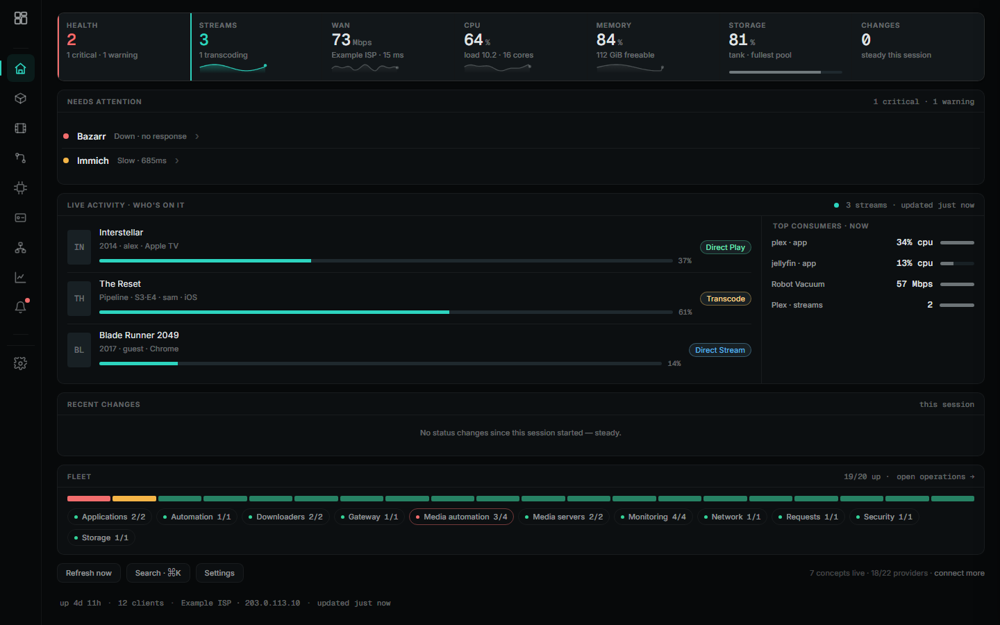
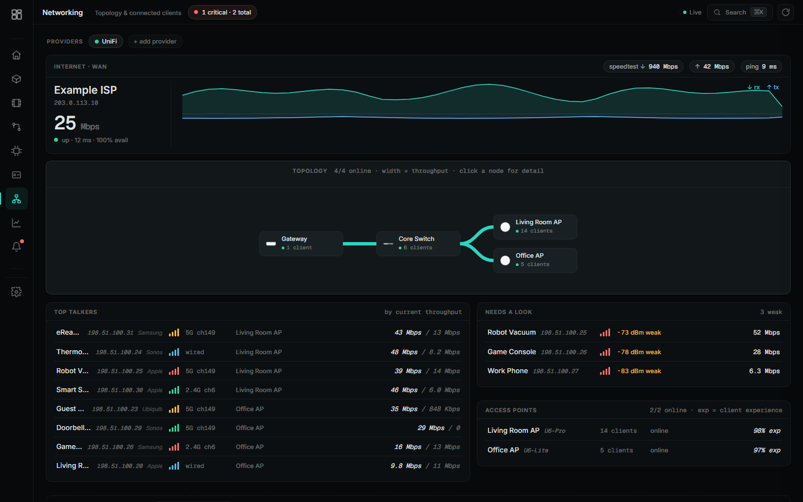
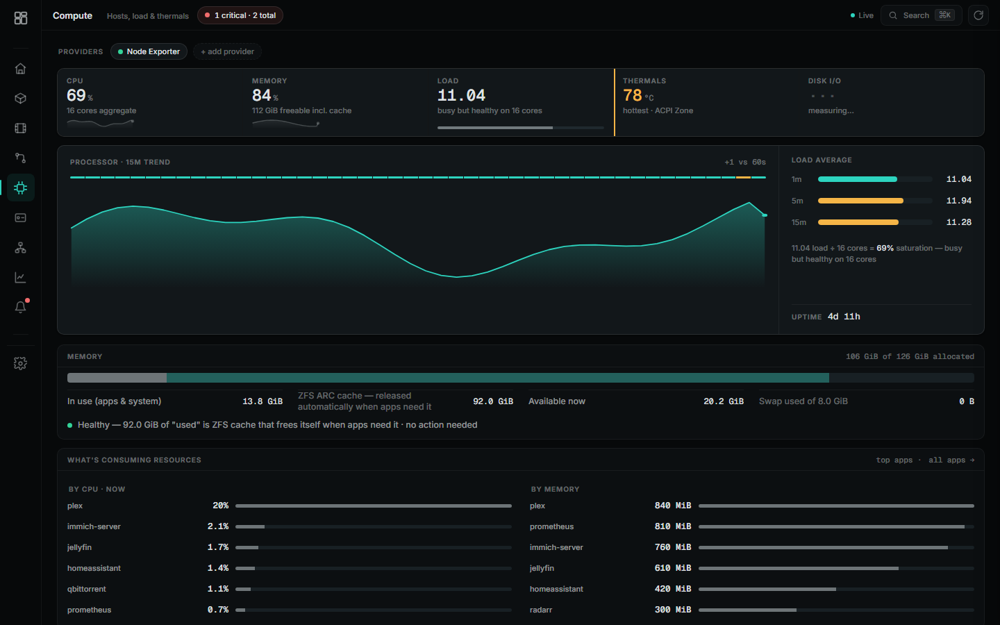
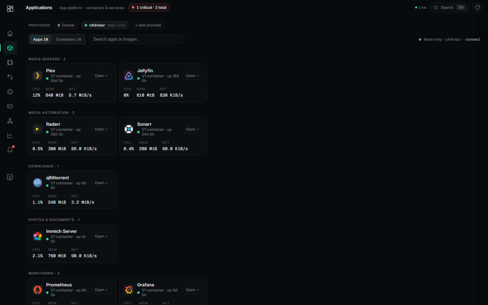
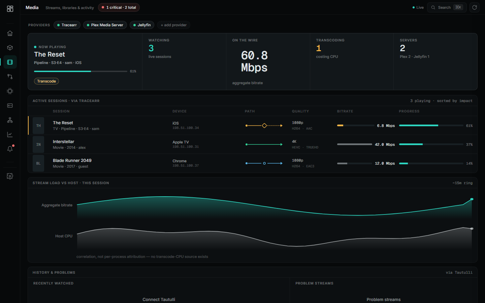
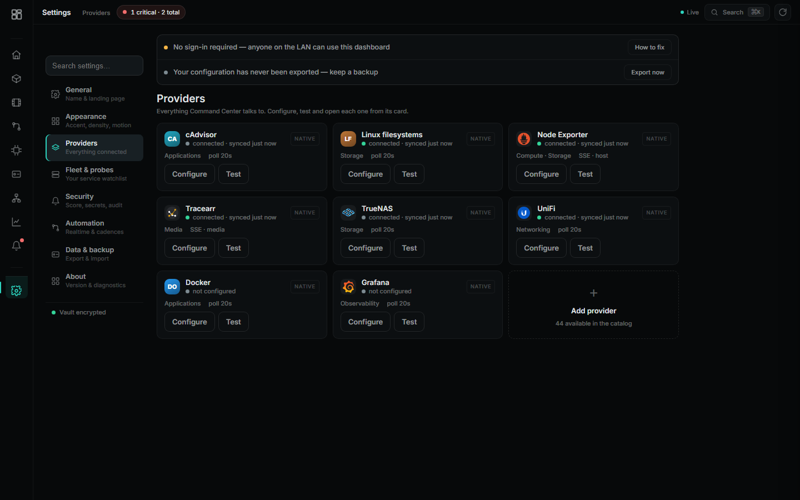
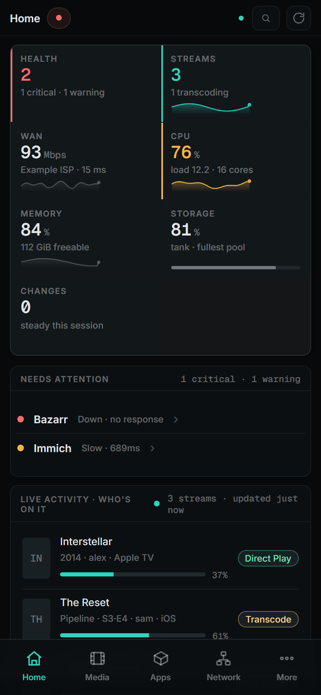

<div align="center">

# Command Center

### Mission control for your homelab.

A single, self-hosted dashboard that unifies your servers, containers, network, storage and media into one calm, real-time operations view — built around **concepts, not products**, so your tools stay swappable.

[](LICENSE)
[](#architecture)
[](INSTALL.md)
[](ROADMAP.md)

[**Quick start**](#quick-start) · [**Screenshots**](#screenshots) · [**Providers**](#supported-providers) · [**Architecture**](ARCHITECTURE.md) · [**Roadmap**](ROADMAP.md) · [**Contributing**](CONTRIBUTING.md)

</div>

---

## What it is

Most homelab dashboards are a wall of link tiles or a grid of gauges. Command Center is different: it's an **operations console**. It answers the questions you actually have —

- Is everything healthy, and if not, **what needs attention**?
- **Who or what** is using resources right now?
- Is media playing? Is the network healthy? Is compute under pressure?
- **What changed** since I last looked?

It talks to the tools you already run, normalizes them behind a common provider interface, and presents each domain with a purpose-built instrument instead of a generic card.

> **Design principle:** a concept (Media, Storage, Networking…) only appears when it has at least one connected provider. No empty rooms. Nothing is ever faked — if a number can't be measured, the UI says so.

## Feature highlights

| | |
|---|---|
| 🩺 **Command-deck home** | Health, alerts, live activity, top consumers and what-changed in one glance. |
| 🌐 **Topology-first networking** | A real UniFi topology map with link weights, top talkers, per-AP health and a searchable client drawer. |
| 🧠 **Compute cockpit** | CPU trend, honest memory pressure (ZFS-ARC aware), a thermal heat-map and top resource consumers. |
| 📦 **App-centric operations** | Containers grouped into the *apps* they belong to, with health, resource rollups and a detail drawer. |
| 🎬 **Live media floor** | Real-time streams with direct-play/transcode detection, bitrate impact and per-session detail. |
| ⚡ **Real-time by default** | One SSE stream fans server-sampled updates to every tab — no per-tab polling storms. |
| 🔌 **40+ providers** | A data-driven integration catalog; add one by appending a single object. |
| 🔒 **Secure by construction** | Encrypted secret vault, server-side token proxy, CSRF + rate-limiting, SSRF-guarded fetches, audit journal. |
| 📱 **Genuinely responsive** | Purpose-built layouts for phone, tablet, desktop and ultrawide — not a shrunk desktop. |
| 🎨 **Premium, restrained UI** | The "GAUGE" design language: near-black canvas, color spent only on state, one hero instrument per view. |

## Screenshots

> All screenshots are captured from the real application running in **demo mode** (`DEMO=1`) — synthetic but realistic data, zero real infrastructure.

| Home | Networking | Compute |
|---|---|---|
|  |  |  |

| Applications | Media | Settings |
|---|---|---|
|  |  |  |

The same **Home** view on a phone — a purpose-built layout with a bottom tab bar, not a shrunk desktop:

<p></p>

## Quick start

**Try the live demo in 15 seconds** — no configuration, fully synthetic data:

```bash
docker run --rm -p 8888:8888 -e DEMO=1 ghcr.io/techfather-glitch/command-center:latest
# open http://localhost:8888
```

**Run it for real** with Docker Compose:

```bash
git clone https://github.com/techfather-glitch/command-center.git
cd command-center
cp .env.example .env          # edit to taste (see INSTALL.md)
docker compose up -d
# open http://localhost:8888 and add your first provider in Settings
```

No database, no build step, no npm install. See **[INSTALL.md](INSTALL.md)** for reverse-proxy, HTTPS and provider setup.

## Supported providers

Command Center groups everything behind **concepts**. Providers plug in underneath:

| Concept | Providers |
|---|---|
| **Media** | Plex · Jellyfin · Emby · Tautulli · Tracearr · Dropped Needle |
| **Automation** | Sonarr · Radarr · Lidarr · Prowlarr · Bazarr · qBittorrent · qui · SABnzbd · Overseerr |
| **Compute** | Node Exporter · Proxmox · Docker · Portainer |
| **Applications** | Docker · cAdvisor · Portainer |
| **Storage** | TrueNAS · Linux filesystems · Scrutiny |
| **Networking** | UniFi · AdGuard Home · Pi-hole |
| **Observability** | Grafana · Prometheus · Loki · Uptime Kuma · Netdata · Gatus |
| **Home & security** | Home Assistant · Vaultwarden · Authentik · CrowdSec |

…and ~40 total in the catalog. Adding a new one is a single data object — see [ARCHITECTURE.md](ARCHITECTURE.md#the-provider-system).

## Connecting Docker

The **Docker** provider gives you live per-container CPU/RAM, start / stop / restart and logs. It needs Docker's **Engine API** — not the raw socket mounted into a container, and **not** a Dockge or Portainer web UI (those are management apps that happen to sit *on top of* Docker; they aren't the API).

Exposing the raw socket over TCP (`-H tcp://0.0.0.0:2375`) is unauthenticated root access to your whole host — don't do that. The safe, standard way is a tiny read-scoped **socket-proxy** that forwards only the calls Command Center needs. Add it as its own stack (Dockge, Portainer, or plain `docker compose`):

```yaml
services:
  dockerproxy:
    image: tecnativa/docker-socket-proxy
    container_name: docker-socket-proxy
    environment:
      - CONTAINERS=1   # list, inspect, live CPU/RAM, logs
      - POST=1         # start / stop / restart
      - INFO=1
      - VERSION=1
    ports:
      - "2375:2375"
    volumes:
      - /var/run/docker.sock:/var/run/docker.sock:ro
    restart: unless-stopped
```

Then in Command Center open **Settings → Providers → Docker → Configure** and set **Docker host** to the proxy's address — your Docker host's LAN IP, e.g. `http://192.168.1.10:2375`. Save, and your containers come alive with live stats and controls, and the **Logs** page lights up.

> **Keep it on the LAN.** Even proxied, port 2375 can start and stop containers — never expose it to the internet or route it through a public tunnel.

## Architecture

- **One Node.js file, zero npm dependencies.** The server (`server.js`) uses only Node built-ins — `http`, `crypto`, `net`, `tls`, `zlib`. No framework, no build.
- **One HTML file for the client** (`app.html`) — a hand-written SPA, no bundler.
- **Server owns the secrets and the network.** The browser never sees a provider token or reaches a provider directly; the server proxies, caches and normalizes.
- **Realtime via SSE.** The server samples status/host/media on its own timers and streams deltas to every client.

Full write-up in **[ARCHITECTURE.md](ARCHITECTURE.md)**.

## Roadmap

Command Center is in active development. Highlights on the way: first-run onboarding wizard, multi-user accounts, notification channels, and more provider adapters. See **[ROADMAP.md](ROADMAP.md)**.

## Contributing

Contributions are very welcome — new providers especially are easy to add. Start with **[CONTRIBUTING.md](CONTRIBUTING.md)** and **[ARCHITECTURE.md](ARCHITECTURE.md)**. Please also read the **[Code of Conduct](CODE_OF_CONDUCT.md)**.

## Security

Found a vulnerability? Please follow the disclosure process in **[SECURITY.md](SECURITY.md)** — don't open a public issue for it.

## Acknowledgments

Parts of Command Center were built with assistance from [Claude](https://www.anthropic.com/claude) (Anthropic).

## License

[MIT](LICENSE) © Command Center contributors.
